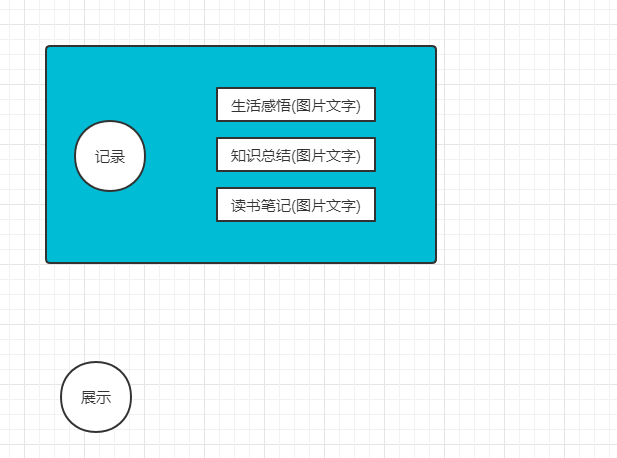

# vnote

**更新记录**

# 版本号 vnote 3.10.1

# 项目定位 

# 目标
## 持续做正确的事情
## 迭代思想

# 注意的问题
- 1 有时候图片上传会有延迟。 
- 2 每做一件事要以项目可控的形式进行，例如github项目，读书笔记，每读一本书都要新建一个文件夹等等，要保证各个事情之间不会相互影响。

**更新记录 2022-4-18**

将整体的笔记迁移到typora+github

