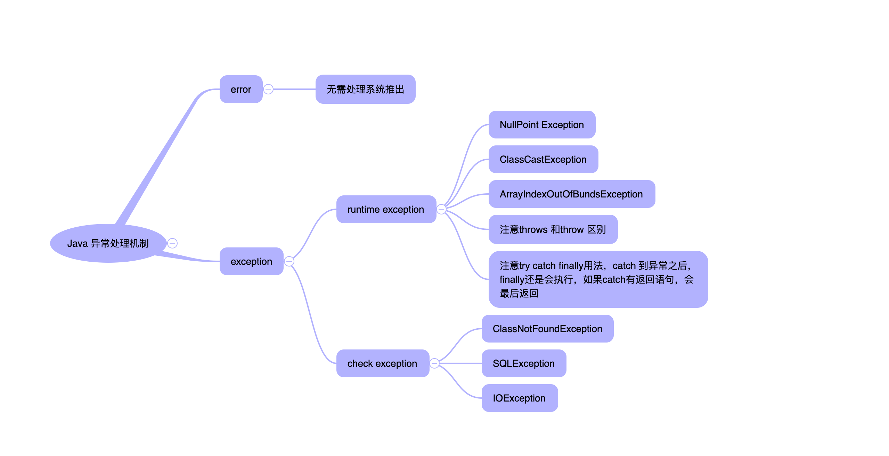

# 黑马程序员
本篇文章记录黑马程序员中java基础考点

## HashCode()和equals()的区别

首先源码中有约定，对象相等的 两个对象 hashcode 一定相等
Object中equals比较的是对象地址。如果项目需求需求需要修改equals方法，则必须要修改hashcode 方法。否则会违反约定！

## java虚拟机中的内存模型-线程内存空间

理解计算机实体模型 和 jvm 内存模型的联系与区别

## java中异常处理机制的简单原理和应用

结合项目的中的使用场景，总结下异常的处理流程从原理和实际  

首先弄清楚java的异常处理机制

# 如何创建线程

* 1 继承thread 重写run
* 2 实现 runable 方法
* 3 实现callable 方法
* 4 直接使用线程池

# 如何解决多线程同步问题

PC-HZ20192523.hikvision.com

NB-HZ20086326.hikvision.com

巡更

国土违建巡察

时间有限，修改大文件框架放在后面优化

远程办公环境没有办法在获取到新的app截图了。。

的嘴上main

（整改任务）

该模块最上面部分5个tab页面，标题是状态名称和相应事件数量拼接而成。

当有新的平台时间

事件签收

平台端下发事件后，会首次出现在app的待签收列表中，当app用户点击待签收列表中的信息详情会出现如下图所示的页面。点击签收则改信息会移动到
待处置列表，如果点击拒收则会被移动到待审核列表（该用户拥有审核的权限）

当app正常签收事件后事件会出现在待处置列表中，当app用户点击待处置列表中的信息详情会出现如下图所示的页面。用户可以选择处置为误报、正常用地、违规用地。处置完成之后任务会被移动到待审核列表（该用户拥有审核的权限），处置部分除了可以正常处置之外还能点击退会。退回之后任务同样会出现在待审核列表中。

在任务签收后任何一个流程，app用户可以随意进行多次反馈

审核部分的数据来源有三个部分，签收退回、处置退回、处置完成。如果是签收退回，那么审核之后任务回归待签收状态，如果是处置退回，那么审核之后任务回归待处置状态。如果任务是处置完成审核，那么就分为两种情况，审核通过则任务切换成完成状态，如果审核不通过则任务变成待处置状态。

文件管理
wei9122*

查

支持消息接受、签收、处置、审核等操作
已修改

查看文档
注意如果app需要开启自动消息刷新功能，需要在该登陆用户的角色权限开启消息通知选项

重复

消息中心

