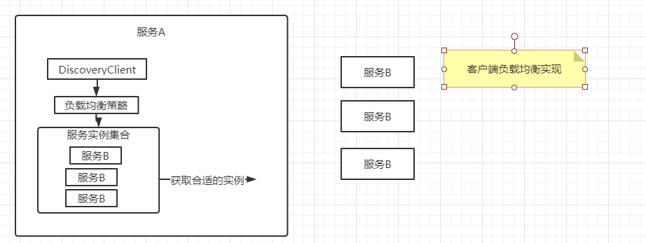
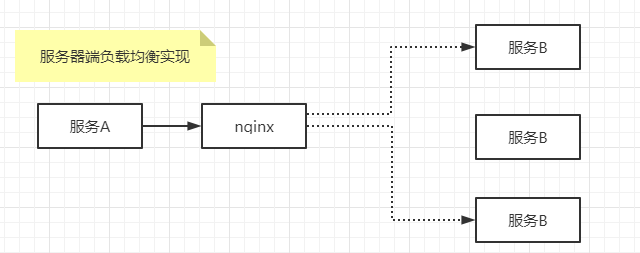
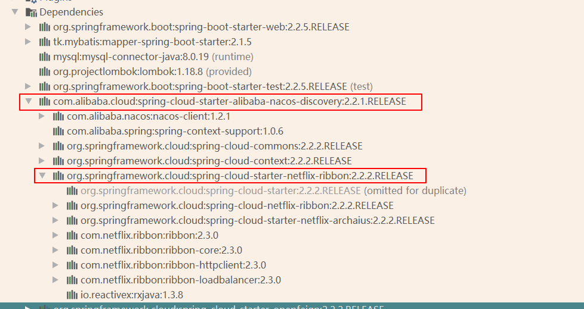
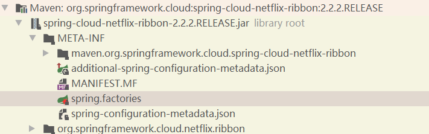

# SpringCloud之Ribbon

## 背景
要保证高可用，必须实现负载均衡，其中负载均衡有两种实现方式

- 客户端负载均衡 （例如ribbon）


- 服务器端负载均衡（例如nginx）



## 依赖关系


## start 模块 引入到spring过程

### 加依赖（有可能不需要加，被其他的模块引入）



### springboot自动装载
读取META-INF下面的spring.factories文件，并加载文件中的配置类
org.springframework.boot.autoconfigure.EnableAutoConfiguration=\
org.springframework.cloud.netflix.ribbon.RibbonAutoConfiguration

### 读取RibbonAutoConfiguration配置类
```
@Configuration
@Conditional({RibbonAutoConfiguration.RibbonClassesConditions.class})
@RibbonClients
@AutoConfigureAfter(
    name = {"org.springframework.cloud.netflix.eureka.EurekaClientAutoConfiguration"}
)
@AutoConfigureBefore({LoadBalancerAutoConfiguration.class, AsyncLoadBalancerAutoConfiguration.class})
@EnableConfigurationProperties({RibbonEagerLoadProperties.class, ServerIntrospectorProperties.class})
public class RibbonAutoConfiguration {
    @Autowired(
        required = false
    )
    private List<RibbonClientSpecification> configurations = new ArrayList();
    @Autowired
    private RibbonEagerLoadProperties ribbonEagerLoadProperties;

    public RibbonAutoConfiguration() {
    }

    @Bean
    public HasFeatures ribbonFeature() {
        return HasFeatures.namedFeature("Ribbon", Ribbon.class);
    }

    @Bean
    public SpringClientFactory springClientFactory() {
        SpringClientFactory factory = new SpringClientFactory();
        factory.setConfigurations(this.configurations);
        return factory;
    }

    @Bean
    @ConditionalOnMissingBean({LoadBalancerClient.class})
    public LoadBalancerClient loadBalancerClient() {
        return new RibbonLoadBalancerClient(this.springClientFactory());
    }

    @Bean
    @ConditionalOnClass(
        name = {"org.springframework.retry.support.RetryTemplate"}
    )
    @ConditionalOnMissingBean
    public LoadBalancedRetryFactory loadBalancedRetryPolicyFactory(final SpringClientFactory clientFactory) {
        return new RibbonLoadBalancedRetryFactory(clientFactory);
    }

    @Bean
    @ConditionalOnMissingBean
    public PropertiesFactory propertiesFactory() {
        return new PropertiesFactory();
    }

    @Bean
    @ConditionalOnProperty({"ribbon.eager-load.enabled"})
    public RibbonApplicationContextInitializer ribbonApplicationContextInitializer() {
        return new RibbonApplicationContextInitializer(this.springClientFactory(), this.ribbonEagerLoadProperties.getClients());
    }

    static class RibbonClassesConditions extends AllNestedConditions {
        RibbonClassesConditions() {
            super(ConfigurationPhase.PARSE_CONFIGURATION);
        }

        @ConditionalOnClass({Ribbon.class})
        static class RibbonPresent {
            RibbonPresent() {
            }
        }

        @ConditionalOnClass({AsyncRestTemplate.class})
        static class AsyncRestTemplatePresent {
            AsyncRestTemplatePresent() {
            }
        }

        @ConditionalOnClass({RestTemplate.class})
        static class RestTemplatePresent {
            RestTemplatePresent() {
            }
        }

        @ConditionalOnClass({IClient.class})
        static class IClientPresent {
            IClientPresent() {
            }
        }
    }

    private static class OnRibbonRestClientCondition extends AnyNestedCondition {
        OnRibbonRestClientCondition() {
            super(ConfigurationPhase.REGISTER_BEAN);
        }

        @ConditionalOnProperty({"ribbon.restclient.enabled"})
        static class RibbonProperty {
            RibbonProperty() {
            }
        }

        /** @deprecated */
        @Deprecated
        @ConditionalOnProperty({"ribbon.http.client.enabled"})
        static class ZuulProperty {
            ZuulProperty() {
            }
        }
    }

    @Target({ElementType.TYPE, ElementType.METHOD})
    @Retention(RetentionPolicy.RUNTIME)
    @Documented
    @Conditional({RibbonAutoConfiguration.OnRibbonRestClientCondition.class})
    @interface ConditionalOnRibbonRestClient {
    }

    @Configuration(
        proxyBeanMethods = false
    )
    @ConditionalOnClass({HttpRequest.class})
    @RibbonAutoConfiguration.ConditionalOnRibbonRestClient
    protected static class RibbonClientHttpRequestFactoryConfiguration {
        @Autowired
        private SpringClientFactory springClientFactory;

        protected RibbonClientHttpRequestFactoryConfiguration() {
        }

        @Bean
        public RestTemplateCustomizer restTemplateCustomizer(final RibbonClientHttpRequestFactory ribbonClientHttpRequestFactory) {
            return (restTemplate) -> {
                restTemplate.setRequestFactory(ribbonClientHttpRequestFactory);
            };
        }

        @Bean
        public RibbonClientHttpRequestFactory ribbonClientHttpRequestFactory() {
            return new RibbonClientHttpRequestFactory(this.springClientFactory);
        }
    }
}
```

### 重点关注LoadBalancerClient，实现类为RibbonLoadBalancerClient

核心逻辑：
定义：LoadBalancerInterceptor 拦截器，执行RibbonLoadBalancerClient 中的execute方法。
核心代码：
```
    public ClientHttpResponse intercept(final HttpRequest request, final byte[] body, final ClientHttpRequestExecution execution) throws IOException {
        URI originalUri = request.getURI();
        String serviceName = originalUri.getHost();
        Assert.state(serviceName != null, "Request URI does not contain a valid hostname: " + originalUri);
        return (ClientHttpResponse)this.loadBalancer.execute(serviceName, this.requestFactory.createRequest(request, body, execution));
    }
```
```
    public <T> T execute(String serviceId, LoadBalancerRequest<T> request, Object hint) throws IOException {
        ILoadBalancer loadBalancer = this.getLoadBalancer(serviceId);
        Server server = this.getServer(loadBalancer, hint);
        log.info("request url is : {}:{}",server.getHost(),server.getPort());
        if (server == null) {
            throw new IllegalStateException("No instances available for " + serviceId);
        } else {
            RibbonLoadBalancerClient.RibbonServer ribbonServer = new RibbonLoadBalancerClient.RibbonServer(serviceId, server, this.isSecure(server,                 serviceId), this.serverIntrospector(serviceId).getMetadata(server));
            return (T) this.execute(serviceId, (ServiceInstance)ribbonServer, (LoadBalancerRequest)request);
        }
    }
```

## 负载均衡及配置
```
 规则都实现了choose方法,
    public Server choose(Object key) {
        int count = 0;

        for(Server server = this.roundRobinRule.choose(key); count++ <= 10; server = this.roundRobinRule.choose(key)) {
            if (this.predicate.apply(new PredicateKey(server))) {
                return server;
            }
        }

        return super.choose(key);
    }

```

### 可用规则

BestAvailableRule
ClientConfigEnabledRoundRobinRule
PredicateBasedRule
RandomRule
RetryRule
RoundRobinRule
AvailabilityFilteringRule

## Ribbon自定义负载均衡规则
```
继承AbstractLoadBalancerRule重写choose方法
@Slf4j
public class NacosWeightedRule extends AbstractLoadBalancerRule {
    @Autowired
    private NacosDiscoveryProperties nacosDiscoveryProperties;
    @Override
    public void initWithNiwsConfig(IClientConfig iClientConfig) {
        //读取配置文件，并初始化，留空处理
    }

    @Override
    public Server choose(Object o) {
        BaseLoadBalancer loadBalancer = (BaseLoadBalancer) this.getLoadBalancer();
        log.info("lb = {}",loadBalancer);
        //获取想要请求的微服务名称
        String name = loadBalancer.getName();
        //实现负载均衡算法。。
        //拿到服务发现相关api
        NamingService namingService = nacosDiscoveryProperties.namingServiceInstance();
        //nacos client 自动通过权重算法获取实例
        try {
            Instance instance =  namingService.selectOneHealthyInstance(name);
            log.info("选择的实例ip是{},端口是{}:instance = {}",instance.getIp(),instance.getPort(),instance);
            return new NacosServer(instance);
        } catch (NacosException e) {
            e.printStackTrace();
        }
        return null;
    }
}

细粒度配置生效
user-center:
  ribbon:
    NFLoadBalancerRuleClassName: com.wei.contentcenter.config.NacosWeightedRule

```


## 最佳实践
```
RestTemplate类增加@LoadBalanced注解
 @Bean
    @LoadBalanced
    public RestTemplate restTemplate(){
        RestTemplate template = new RestTemplate();
        template.setInterceptors(Collections.singletonList(new TemplateLogInterceptor()));
        return new RestTemplate();
    }
    

(ServiceId)
user-center:
  ribbon:
    NFLoadBalancerRuleClassName: com.netflix.loadbalancer.RandomRule

```


