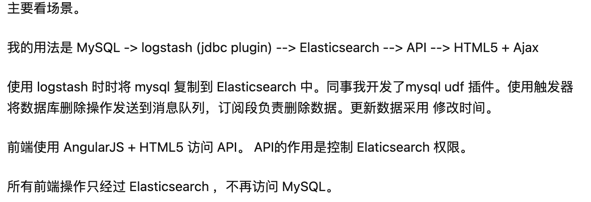

# elasticsearch实践
## 背景
河北项目中xres上了es，作为一个优秀的程序员当然要与时俱进，学习一波。弄清楚是什么，怎么用！

## 相关概念
### 索引  

一个索引就是一个拥有几分相似特征的文档的集合。比如说，你可以有一个客户数据的索引，另一个产品目录的索引，还有一个订单数据的索引。一个索引由一个名字来标识（必须全部是小写字母的），并且当我们要对对应于这个索引中的文档进行索引、搜索、更新和删除的时候，都要使用到这个名字。索引类似于关系型数据库中Database的概念。在一个集群中，如果你想，可以定义任意多的索引。


### 类型
在一个索引中，你可以定义一种或多种类型。一个类型是你的索引的一个逻辑上的分类/分区，其语义完全由你来定。通常，会为具有一组共同字段的文档定义一个类型。比如说，我们假设你运营一个博客平台并且将你所有的数据存储到一个索引中。在这个索引中，你可以为用户数据定义一个类型，为博客数据定义另一个类型，当然，也可以为评论数据定义另一个类型。类型类似于关系型数据库中Table的概念。

### 文档
一个文档是一个可被索引的基础信息单元。比如，你可以拥有某一个客户的文档，某一个产品的一个文档，当然，也可以拥有某个订单的一个文档。文档以JSON（Javascript Object Notation）格式来表示，而JSON是一个到处存在的互联网数据交互格式。 
在一个index/type里面，只要你想，你可以存储任意多的文档。注意，尽管一个文档，物理上存在于一个索引之中，文档必须被索引/赋予一个索引的type。文档类似于关系型数据库中Record的概念。实际上一个文档除了用户定义的数据外，还包括_index、_type和_id字段。

### 分片和复制
一个索引可以存储超出单个结点硬件限制的大量数据。比如，一个具有10亿文档的索引占据1TB的磁盘空间，而任一节点都没有这样大的磁盘空间；或者单个节点处理搜索请求，响应太慢。

为了解决这个问题，Elasticsearch提供了将索引划分成多份的能力，这些份就叫做分片。当你创建一个索引的时候，你可以指定你想要的分片的数量。每个分片本身也是一个功能完善并且独立的“索引”，这个“索引”可以被放置到集群中的任何节点上。 
分片之所以重要，主要有两方面的原因：

允许你水平分割/扩展你的内容容量
允许你在分片（潜在地，位于多个节点上）之上进行分布式的、并行的操作，进而提高性能/吞吐量
至于一个分片怎样分布，它的文档怎样聚合回搜索请求，是完全由Elasticsearch管理的，对于作为用户的你来说，这些都是透明的。

在一个网络/云的环境里，失败随时都可能发生，在某个分片/节点不知怎么的就处于离线状态，或者由于任何原因消失了。这种情况下，有一个故障转移机制是非常有用并且是强烈推荐的。为此目的，Elasticsearch允许你创建分片的一份或多份拷贝，这些拷贝叫做复制分片，或者直接叫复制。复制之所以重要，主要有两方面的原因：

在分片/节点失败的情况下，提供了高可用性。因为这个原因，注意到复制分片从不与原/主要（original/primary）分片置于同一节点上是非常重要的。
扩展你的搜索量/吞吐量，因为搜索可以在所有的复制上并行运行
总之，每个索引可以被分成多个分片。一个索引也可以被复制0次（意思是没有复制）或多次。一旦复制了，每个索引就有了主分片（作为复制源的原来的分片）和复制分片（主分片的拷贝）之别。分片和复制的数量可以在索引创建的时候指定。在索引创建之后，你可以在任何时候动态地改变复制数量，但是不能改变分片的数量。

默认情况下，Elasticsearch中的每个索引被分片5个主分片和1个复制，这意味着，如果你的集群中至少有两个节点，你的索引将会有5个主分片和另外5个复制分片（1个完全拷贝），这样的话每个索引总共就有10个分片。一个索引的多个分片可以存放在集群中的一台主机上，也可以存放在多台主机上，这取决于你的集群机器数量。主分片和复制分片的具体位置是由ES内在的策略所决定的。

## 部署（单机）
1. 下载地址，下载对应系统的版本 [下载地址](https://www.elastic.co/cn/downloads/elasticsearch)

安装的时候有几个地方需要注意
1.root用户不能直接运行es
2.adduser es
3.chown -R es /path
4.su es 切换用户运行
5.修改配置文件

```
cluster.name: my-application	#集群名
node.name: node-1	#节点名称
path.data: /data/es/data	#数据存储路径
path.logs: /data/es/logs	#日志存储路径
network.host: 192.168.110.112	#本机IP,可以写0.0.0.0
http.port: 9200	#访问端口
discovery.seed_hosts: ["127.0.0.1:9200"]	#通信地址
cluster.initial_master_nodes: ["node-1"]	#master节点名称
http.cors.enabled: true #是否支持跨域，默认为false
http.cors.allow-origin: "*"	#当设置允许跨域，默认为*,表示支持所有域名

```

部署参考
[参考部署](https://blog.csdn.net/qq_39680564/article/details/94399977)

## 思考
es可以当做一个非关系型数据库吗？
搜索相关文档看到一个有意思的方案

