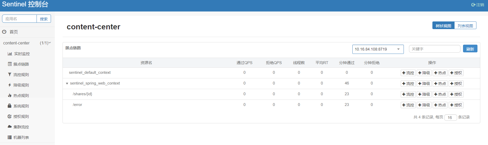
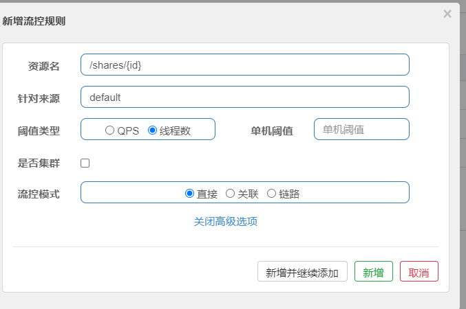

# sentinel实践
## 引入依赖
 <!--服务容错-->
        <dependency>
            <groupId>com.alibaba.cloud</groupId>
            <artifactId>spring-cloud-starter-alibaba-sentinel</artifactId>
        </dependency>
## 整合控台台
```
    sentinel:
      transport:
        # 指定sentinel 控制台的地址
        dashboard: 10.19.134.69:8080
```

## 控制台面板


## 流控规则


## 限流规则配置
sentinal 使用

