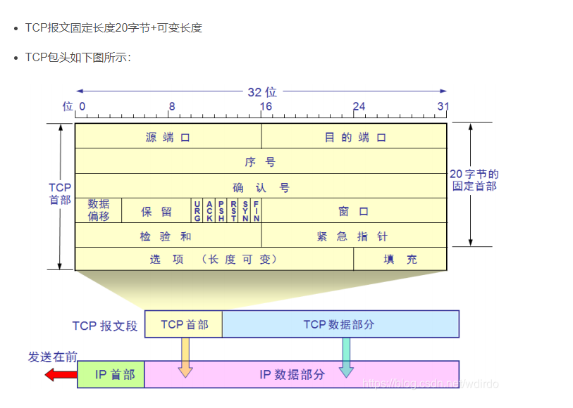
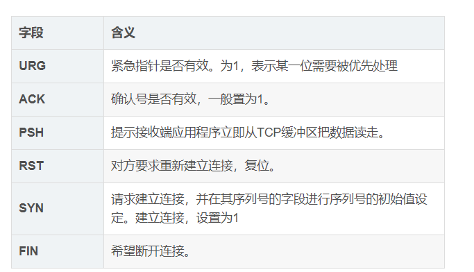
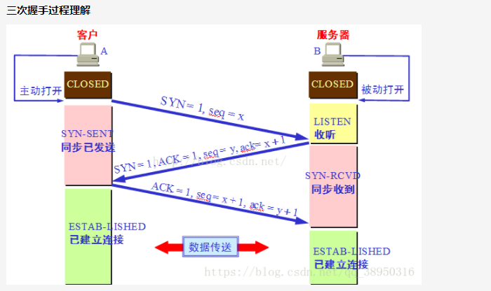

# TCP的三次握手

## IP协议
不可靠，面向非连接
## tcp协议简介
- 面向连接，可靠的，基于字节流的传输层协议
- 将应用层的数据流分割成报文段并发送给目标节点的TCP层
-  数据包都有序号，对方收到则发送ACK确认，未收到则重传
- 使用校验和来检验数据在传输过程中是否有误
## tcp包头
    

- ip + 协议 + 端口 可以唯一确定在网络中的进程(套接字)
理解报文中字段的含义

https://blog.csdn.net/wdirdo/article/details/99706085

## TCP三次握手的流程
握手是为了建立连接

第一次握手：客户端建立连接，客户端发送SYN包（syn=j）到服务器，并进入SYN_SEND状态，等待服务器确认
第二次握手：服务器收到SYN包，必须确认客户的SYN（ack=j+1）,同时自己也发送一个人SYN包（syn=k），即SYN+ACK包，此时服务器进入SYN_RECV状态
第三次握手：客户端收到服务器的SYN+ACK，此包发送完毕，客户端和服务器进入ESTABLISHED状态，完成三次握手

## 实践出真知

wireshark 安装

