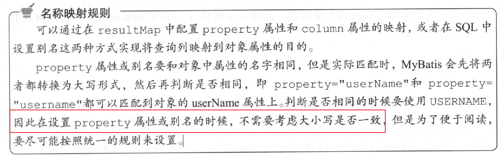
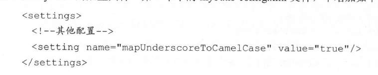
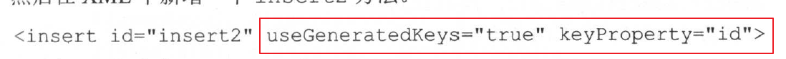
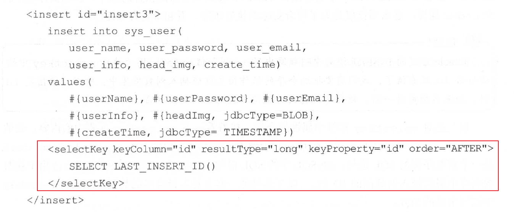
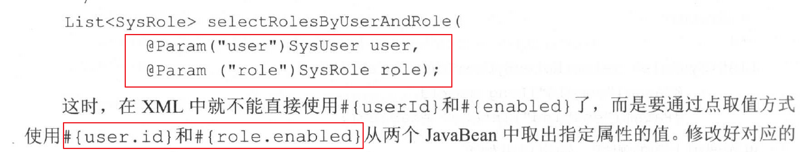

# MyBatis从入门到精通
## 注意1
由于java中的基本数据类型会有默认值，例如当某个类中存在private int age；创建这个类时，age会有默认值0，当使用age属性的时候它总会有值，因此在某些情况下无法实现age为null。并且在动态sql 的部分，如果使用age！=null 进行判断结果总是true，因而会导致很多隐藏问题。
## 注意2
xml 文件中 id不能重复，但是对应的接口是可以重载的

## 接口返回值

## 自动惊醒明明转化

28页

需要做测试，顺便用下用mbg 功能

发现这个自动生成代码的功能还真的挺省事的，学习下
目前看到抽取的基类DAO 方法，还是要在mapper 文件中在实现一遍

## int insert（）
返回的数值表示执行的影响sql 的行数，难怪1表示成功，0表示失败

## 获取主键的方式
* 1可以返回主键

* 2  增加selecetKey 标签

## 传值方式
java bean  和@Param

注意一点 @Param 也可以用户对象传递，mybatis自动将@Param 封装成Map
如果只是一个java对象直接用#{paramname} 就行

# mybstis 动态sql

基本上看下来，大部分掌握，有些细节需要加强
这就是看书的好处，能系统性的掌握一门知识，做到心中有底，

看书还是非常有用的，看书在实践！高效
