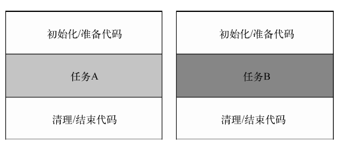

# java8In Action

# Stream API
好处
1，对于集合的内部迭代
2，多核并行处理
# 向方法中传递代码的技巧

# 接口中的默认方法
解决什么问题？
防止在接口中加入新的方法，从而影响了所有的实现类

# 行为参数化
让一个方法接受不同的行为作为参数，并在内部使用他们，完成不用行为的能力，同时使用lambda表示达到简介又灵活的特点

# lambda表达式

使用地方：
## 函数式接口
函数式接口就是只定义一个抽象方法的接口

## 试用场景

