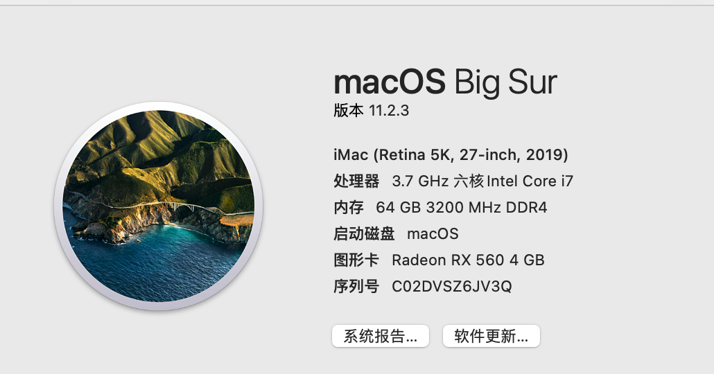

# 升级黑苹果

## 升级opencore

下载最新的open core
https://github.com/acidanthera/OpenCorePkg/releases

## config.plist

- 下载最新的Lilu
- https://github.com/acidanthera/Lilu/releases
- 下载最新的WhateverGreen
- https://github.com/acidanthera/WhateverGreen/releases
- 下载最新的VirtualSMC
- https://github.com/acidanthera/VirtualSMC/releases
- 下载最新的MaciASL.app
- https://github.com/acidanthera/MaciASL/releases

## 重新制作configlist

刷新EFI文件

## 成果

## 参考教程
http://imacos.top/2020/08/10/2259/

