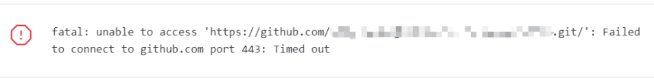

# 报443端口连接超时

## 报错截图


## 解决办法
```
如果使用了梯子，需要设置以下配置（github）
git config --global http.proxy "127.0.0.1:1080"
git config --global https.proxy "127.0.0.1:1080"

（如果使用了gitlab）
git config --global --unset http.proxy "127.0.0.1:1080"
git config --global --unset https.proxy "127.0.0.1:1080"
```