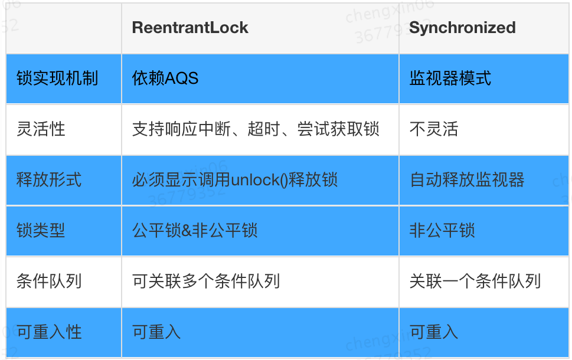
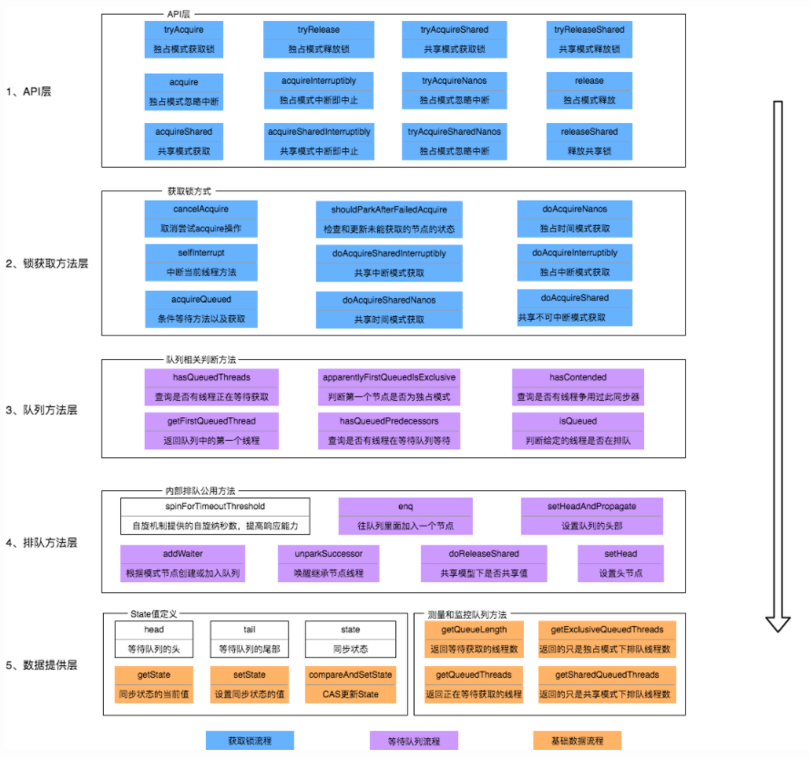
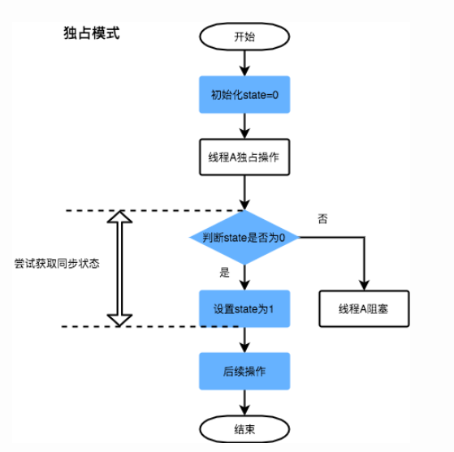
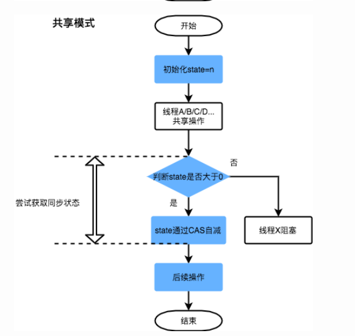
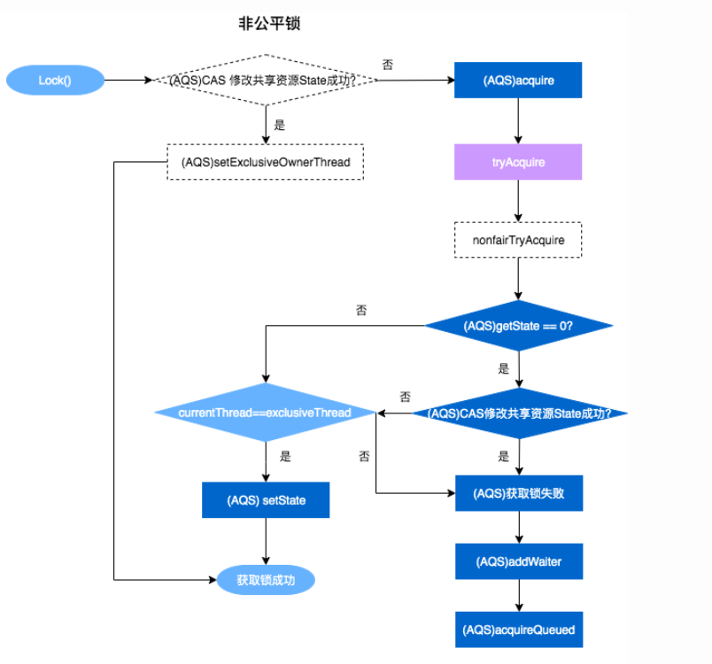
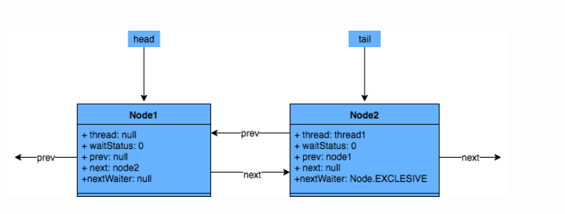

# AQS
## 概念
AQS提供了原子式管理同步状态，阻塞和唤醒线程功能以及队列模型的简单框架


## 和synchronized对比


## AQS框架



## 同步状态加锁过程
### 独占模式


## 共享模式


## 加锁流程源码阅读(非公平锁)
```
 reentrantLock.lock();
 
  ->
  
  public void lock() {
        sync.lock();
    }
    
  ->

    final void lock() {
            if (compareAndSetState(0, 1))
                 setExclusiveOwnerThread(Thread.currentThread() );
            else
                acquire(1);
           }
           
    如果获取锁成功：将当前线程设置成独占线程
    如果获取锁失败，则进行后续处理

```

## 流程图


## 等待双端队列FIFO


## 参考文档
https://tech.meituan.com/2019/12/05/aqs-theory-and-apply.html