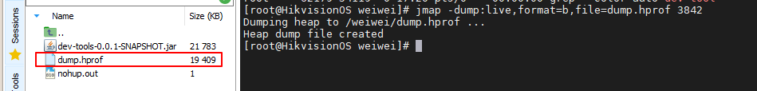
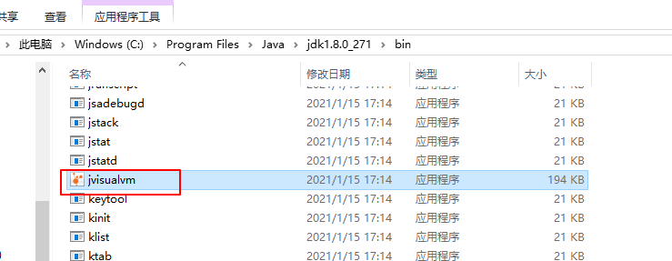

# 监控工具和实战方面

## dump
堆Dump是反应Java堆使用情况的内存镜像，其中主要包括系统信息、虚拟机属性、完整的线程Dump、所有类和对象的状态等。 一般，在内存不足、GC异常等情况下，我们就会怀疑有内存泄露。这个时候我们就可以制作堆Dump来查看具体情况。分析原因。
- 如何把java dump文件导出
1.jmap
2.可视化工具jvm
3.运行参数配置
- 如何定位问题？ 如何解决问题？ 说一下解决思路和处理方法

* 统计线程对象数量和占内存大小【jmap histo:live pid | more】 

* 导出内存统计信息【jmap -dump:live,format:b,file=dump.hprof pid】，二进制生成文档

## dump 文件分析工具
* jvisualvm jdk 自带工具

