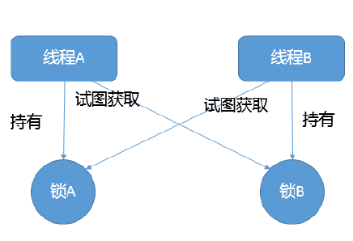
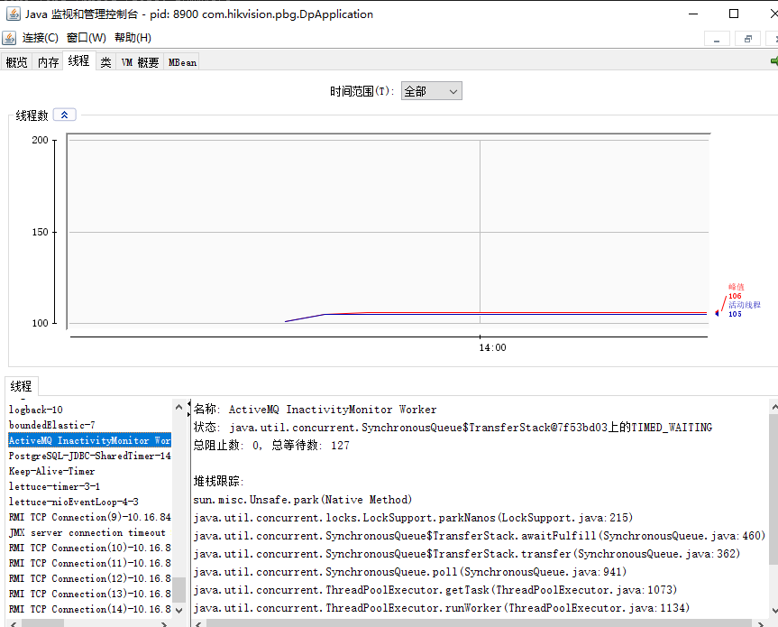
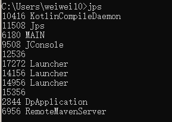
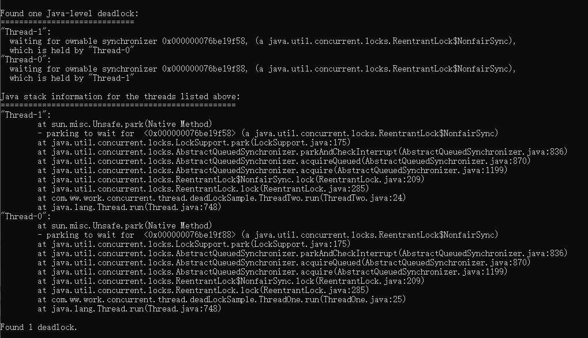

# 线程死锁如何定位与修复

# 背景：啥情况会出现死锁
死锁不仅出现在多线程环境，也会出现在多进程环境，当双方互相持有对方需要的锁，且循环等待，而永久处于阻塞的一种状态，可以用一张图描述



## 定位死锁的方法
jconsole（可视化） 和 jstack（命令行），都可以查看线程状态，进行定位。



## 死锁代码示例
```
public class ThreadOne implements Runnable {
    private String name;
    private Lock lock1;
    private Lock lock2;
    public ThreadOne(String name,Lock lock1,Lock lock2){
         this.name =name;
         this.lock1=lock1;
         this.lock2=lock2;
    }
    @Override
    public void run() {
        log.info("线程{},获取锁{}",name,lock1);
        lock1.lock();
        try {
            log.info("线程{},休眠{}秒",name,3);
            TimeUnit.SECONDS.sleep(3);
            lock2.lock();
            log.info("线程{},执行结束",name);
         } catch (InterruptedException e) {
            e.printStackTrace();
        }finally {
            lock1.unlock();
            lock2.unlock();
        }
    }
}

public class ThreadTwo implements Runnable {
    private String name;
    private Lock lock1;
    private Lock lock2;
    public ThreadTwo(String name,Lock lock1,Lock lock2){
        this.name =name;
        this.lock1=lock1;
        this.lock2=lock2;
    }
    @Override
    public void run() {
        log.info("线程{},获取锁{}",name,lock2);
        lock2.lock();
        try {
            log.info("线程{},休眠{}秒",name,3);
            TimeUnit.SECONDS.sleep(3);
            lock1.lock();
            log.info("线程{},执行结束",name);
        } catch (InterruptedException e) {
            e.printStackTrace();
        }finally {
            lock1.unlock();
            lock2.unlock();
        }

    }
}

public class MAIN {
    public static void main(String[] args) throws InterruptedException {
        Lock lock1 = new ReentrantLock();
        Lock lock2 = new ReentrantLock();
        Thread threadOne = new Thread(new ThreadOne("threadOne",lock1,lock2));
        Thread threadTwo = new Thread(new ThreadTwo("threadTwo",lock1,lock2));
        threadOne.start();
        threadTwo.start();
    }
}

```

## 死锁定位排查
### jps：查看所有java线程 id


### jstack 线程id[获取线程栈信息],会列举线程死锁信息



### 定位问题之后
查找线程状态（WAITING(parking),BLOCKED）-> 查看等待目标-> 对比锁的持有状态
排查代码，修复问题(有提示代码行数)

## 总结
本文介绍了死锁的概念以及在实际项目中的排查手段。例如jps，jstack。
其中在写示例的过程中可以得到以下结论
死锁的产生有以下几个条件
- 互斥条件（锁是互斥的，不能共享）
- 循环依赖（两个实体或者多个实体之前都循环锁依赖）
- 非抢占且不释放锁（获取的锁在线程没有执行完的情况，都不会释放）

针对上面三个条件，我们在写代码的时候自然而然可以想到如何避免死锁
1.锁的个数越少越好
2.锁获取的顺序做封装处理，不能乱序
3.尝试用带超时的方法，在长时间获取不到锁的情况，准备退出逻辑（释放之前获取的锁）
例如Object.wait  CountDownLatch.await() 都支持timed_wait

```
if(lock.tryLock()||lock.tryLock(timeout,unit)){

}

```


