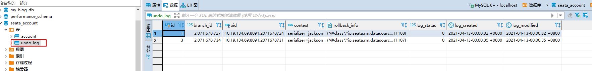

# seata实践

## 部署
下载1.1.0
https://github.com/seata/seata/releases
tar -zxvf filanme

配置nacos地址

启动
nohup ./XX.sh &

##  接入java应用
### 同一应用中针对多数据源

#### 引入依赖
```
   <!-- 实现对 dynamic-datasource 的自动化配置 -->
        <dependency>
            <groupId>com.baomidou</groupId>
            <artifactId>dynamic-datasource-spring-boot-starter</artifactId>
            <version>3.0.0</version>
        </dependency>

        <!-- 实现对 Seata 的自动化配置 -->
        <dependency>
            <groupId>io.seata</groupId>
            <artifactId>seata-spring-boot-starter</artifactId>
            <version>1.1.0</version>
        </dependency>

```

#### service中增加全局事务注解, @GlobalTransactional
```
 @Override
    @DS(value = "order-ds")
    @GlobalTransactional//声明全局事务
    public Integer createOrder(Long userId, Long productId, Integer price) throws Exception {
        Integer amount = 1; // 购买数量，暂时设置为 1。
        logger.info("[createOrder] 当前 XID: {}", RootContext.getXID());
        // 扣减库存
        productService.reduceStock(productId, amount);

        // 扣减余额
        accountService.reduceBalance(userId, price);

        // 保存订单
        OrderDO order = new OrderDO().setUserId(userId).setProductId(productId).setPayAmount(amount * price);
        orderDao.saveOrder(order);
        logger.info("[createOrder] 保存订单: {}", order.getId());
        // 返回订单编号
        return order.getId();
    }
```

#### 注意事项
每个数据库中要增加undo_log 表


### 针对httpClient

把实践弄出来[遇到点问题]


