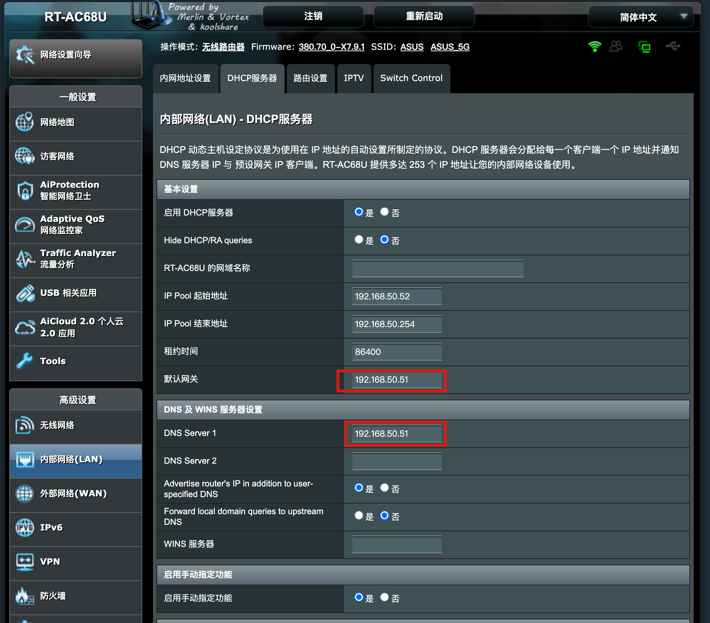
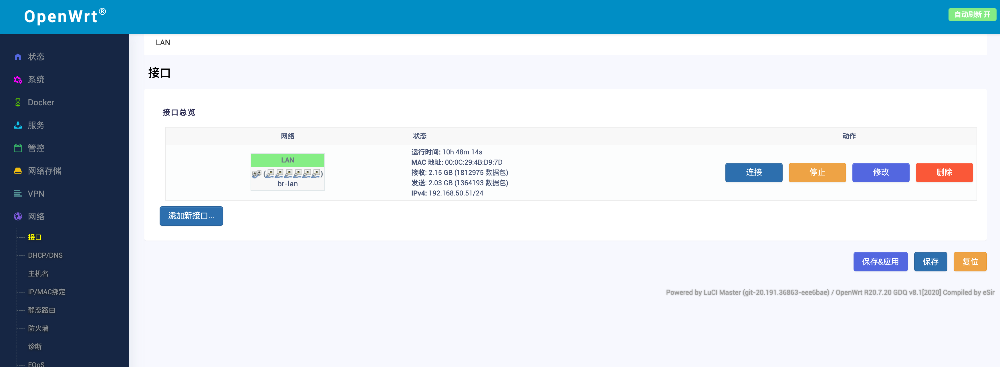
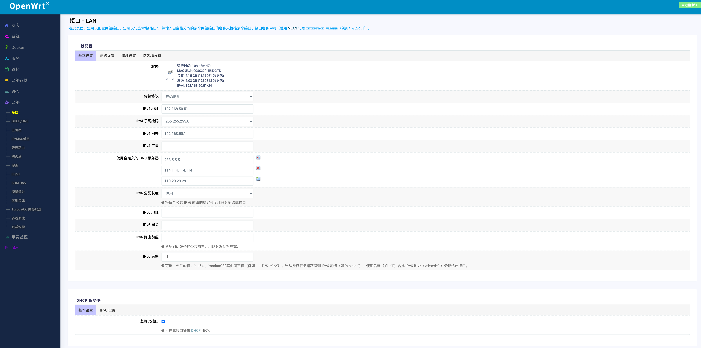
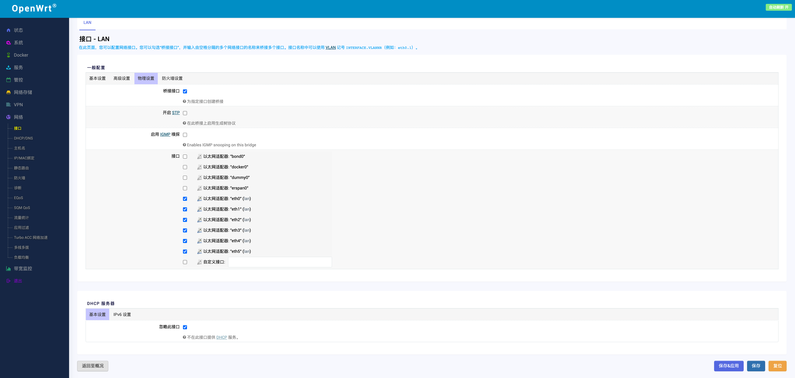
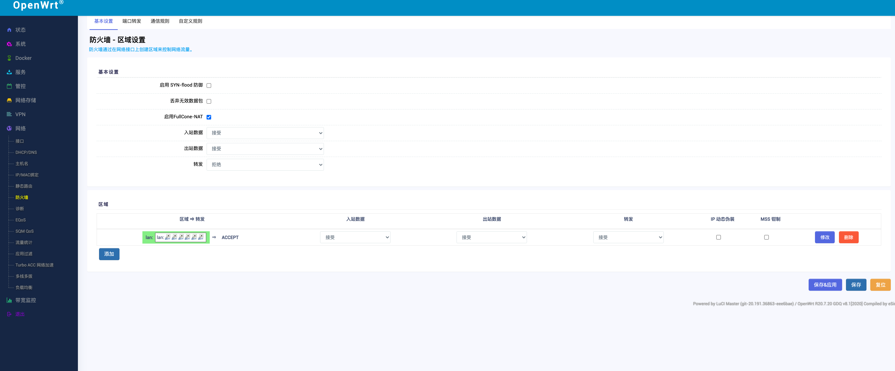
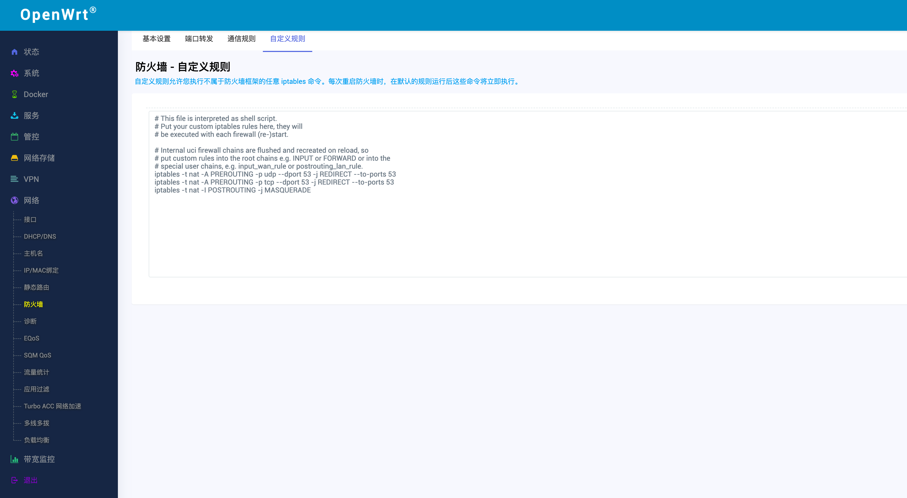

# 我的旁路由设置
# 首先看下网络结构图
设置这种模式的主要原因是目前是处于租房阶段，光猫非常由可能是设置好的，我们直接接主路由上网，因此改动的话最好基于自己接入的设备，不影响他人。

# 总体架构图（软路由设置和主路由设置）

# 注意的地方

- 1 软路由和主路由设置完成之后一定要都重启一遍，不然会出现设置不生效的情况
- 2 软路由接口中要设置桥接（单网口设备可以不桥接，但是多网口设备一定要桥接）

# 设置截图参口

