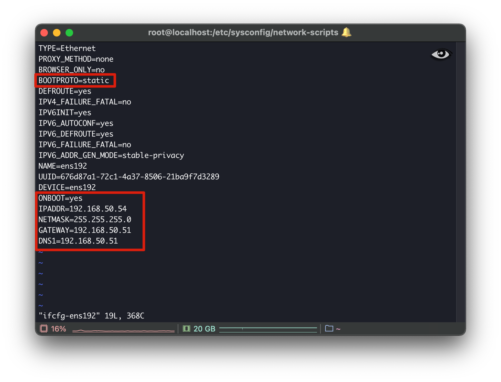

# 搭建一个测试服务器

# 设置ip

cd /etc/sysconfig/network-scripts/ifconfig-ens192

vi ifconfig-ens192

service network restart

修改以下红色部分




# 设置java环境

- 下载得到文件：jdk-8u281-linux-x64.tar.gz
- 解压缩文件：tar -zxvf jdk-8u281-linux-x64.tar.gz -C /usr/local/java
- 配置路径: vim /etc/profile

```
export JAVA_HOME=/usr/local/java/jdk1.8.0_281
export JRE_HOME=${JAVA_HOME}/jre
export CLASSPATH=.:${JAVA_HOME}/lib:${JRE_HOME}/lib
export PATH=${JAVA_HOME}/bin:$PATH

```

- 配置文件生效：source /etc/profile

# 搭建tomcat

/usr/local/tomcat/


# 关闭防火墙，不然端口通
查看防火墙状态
firewall-cmd --state

停止防火墙
systemctl stop firewalld.service

禁止防火墙开机启动
systemctl disable firewalld.service 


# centos 安装 nginx
## 安装软件
sudo yum install epel-release
sudo yum install nginx

## 修改配置
cd /etc/nginx
修改配置文件 nginx.conf,将user root;  修改成root用户，否则后面有权限问题

## 启动 nginx
service nginx start
nginx -s reload

## 新增 nginx配置文件
/etc/nginx/conf.d

```
server{
  listen 80;
  # server_name 8.133.184.84;
  server_name wiki.courseimooc.com;

  location / {
    alias /root/web/;
    index index.html;
    try_files $uri $uri/ /index.html;
  }

}


```


# nginx 403 forbidden 问题解决

临时关闭selinux方法：setenforce 0
永久关闭selinux方法：/etc/selinux/config，将SELINUX=enforcing改为SELINUX=disabled 此方法需要reboot（重启）系统


