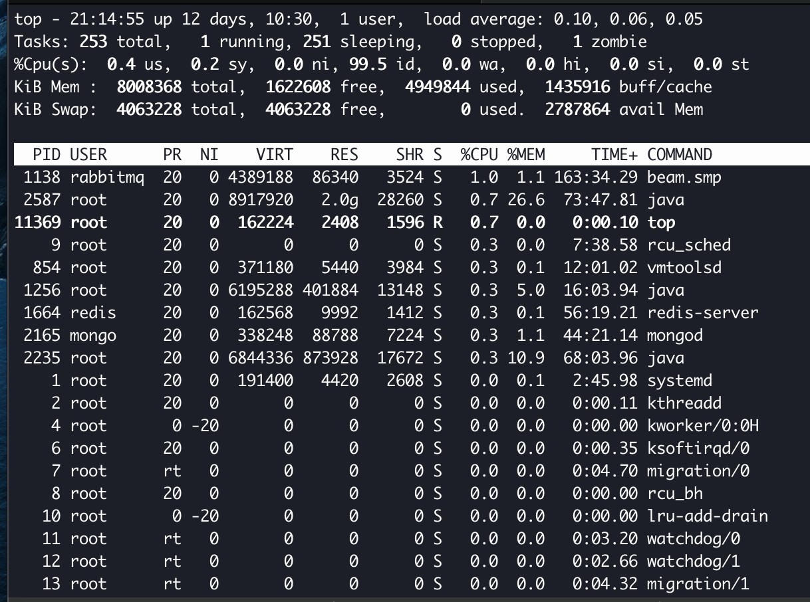
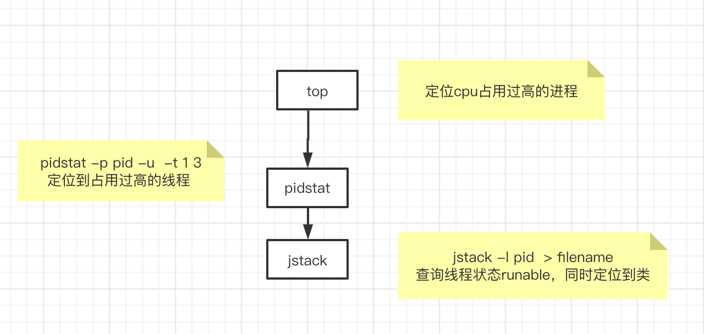
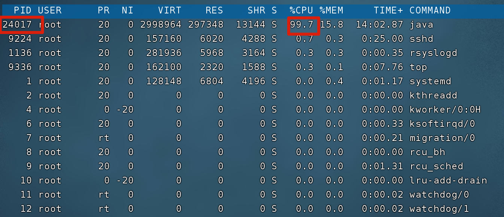
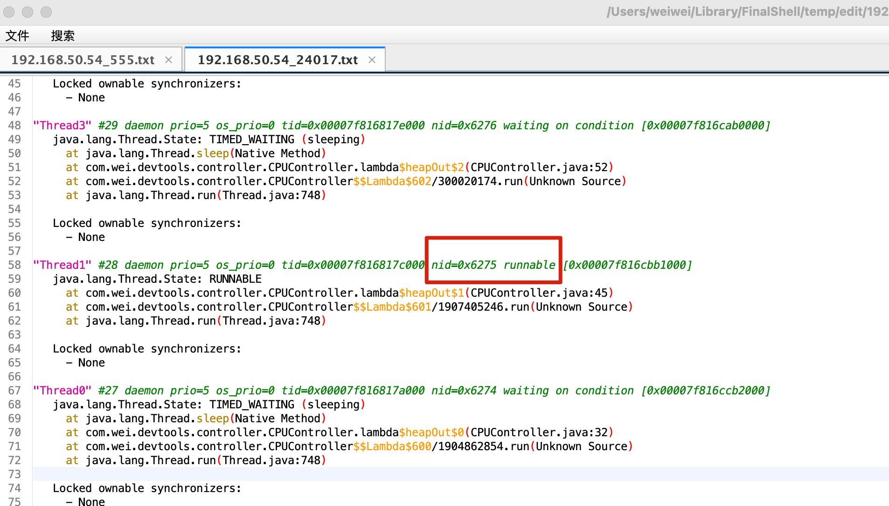
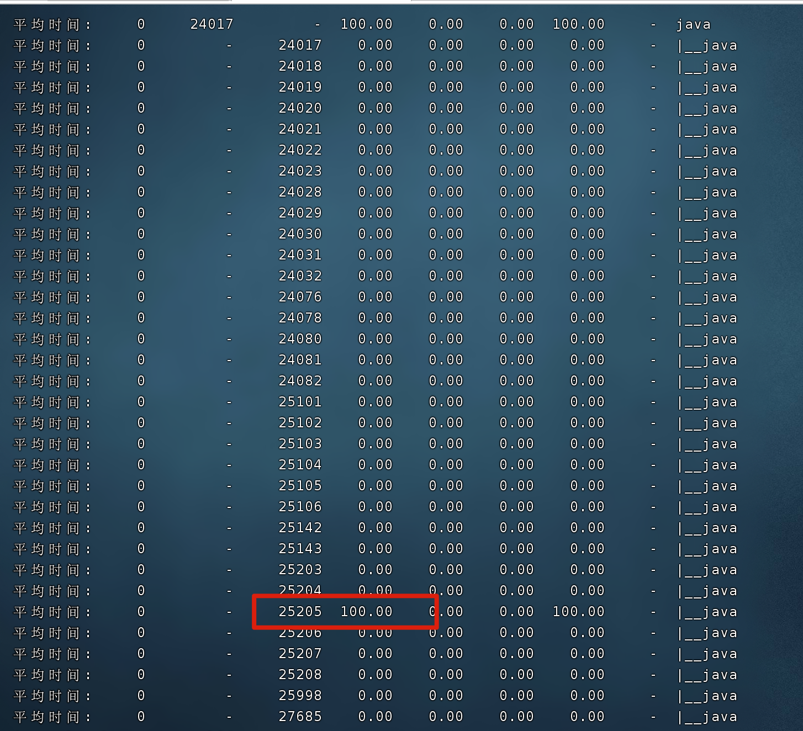
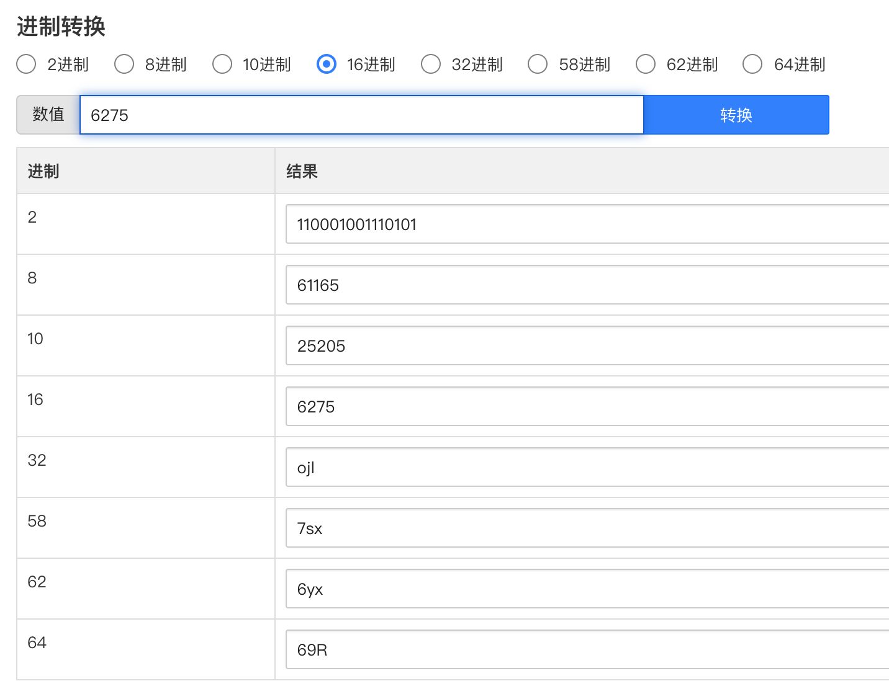

# 服务器问题排查
# 目标
首先能模拟出各种故障情景并在服务器中复现，同时能给出排查步骤和基本的解决方案。

# 监控手段
要先看问题，首先要定位问题
# top

# sar

# 服务器故障类型
## cpu暴增100%

## 定位思路

## 注意一个问题：pidstat 查询的线程id是10进制，而jstack 打印的线程内存快照中，线程id nid是16进制

## 内存占用过高

## tomcat直接挂掉

# 类型模拟代码-复现

## 压力测试jMeter
##

用tomcat比较方便测试-参数好调整。

# 解决方案