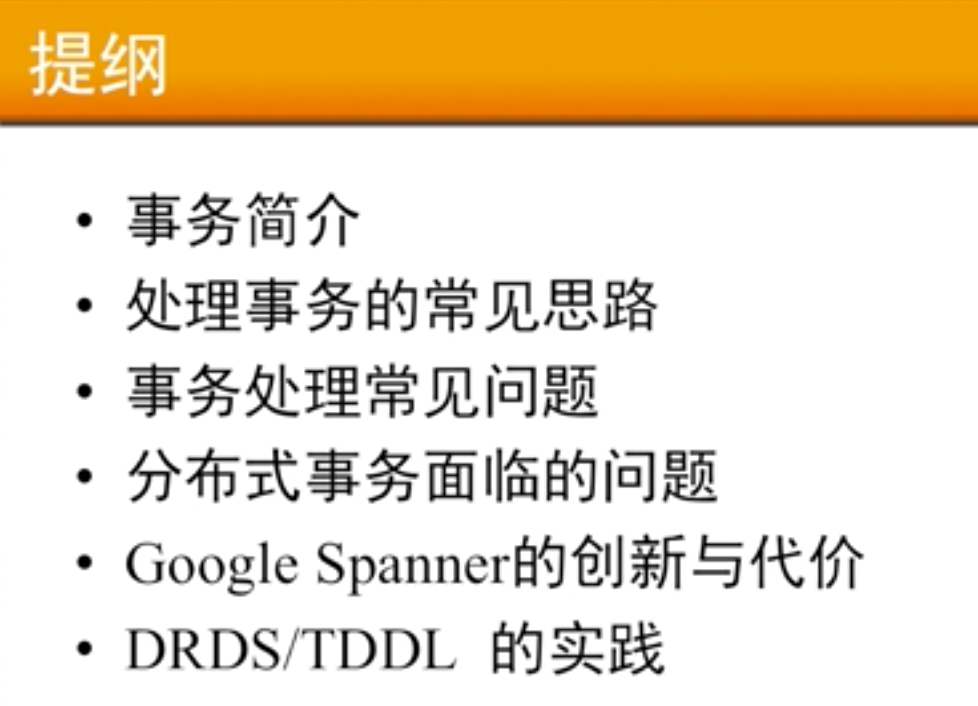

# 事务与分布式事务原理与实践

# part1

## 事务简介
核心是锁 与 并发
- 优势：方便理解
- 劣势：性能较低
ACID
容易理解的模型，性能都不好，性能好的模型都不容易理解

### 单个数据单元

### 一组事务单元

事务单元之前的Happen-before关系
- 读写
- 写读
- 读读
- 写写

如何能够以最快完成？
又您呢个保证上面四种操作的逻辑顺序

### 事务-排队法
序列化读写
- 优势：不需要冲突控制
- 劣势：慢速设备

### 事务-排他锁
### 事务-读写锁
- 针对场景可以做优化

### 事务-MVCC
本质来说就是copy on write
- 能够做到写不阻塞读

## 处理事务的常见思路
## 事务处理常见问题
