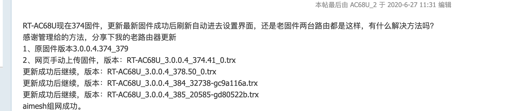
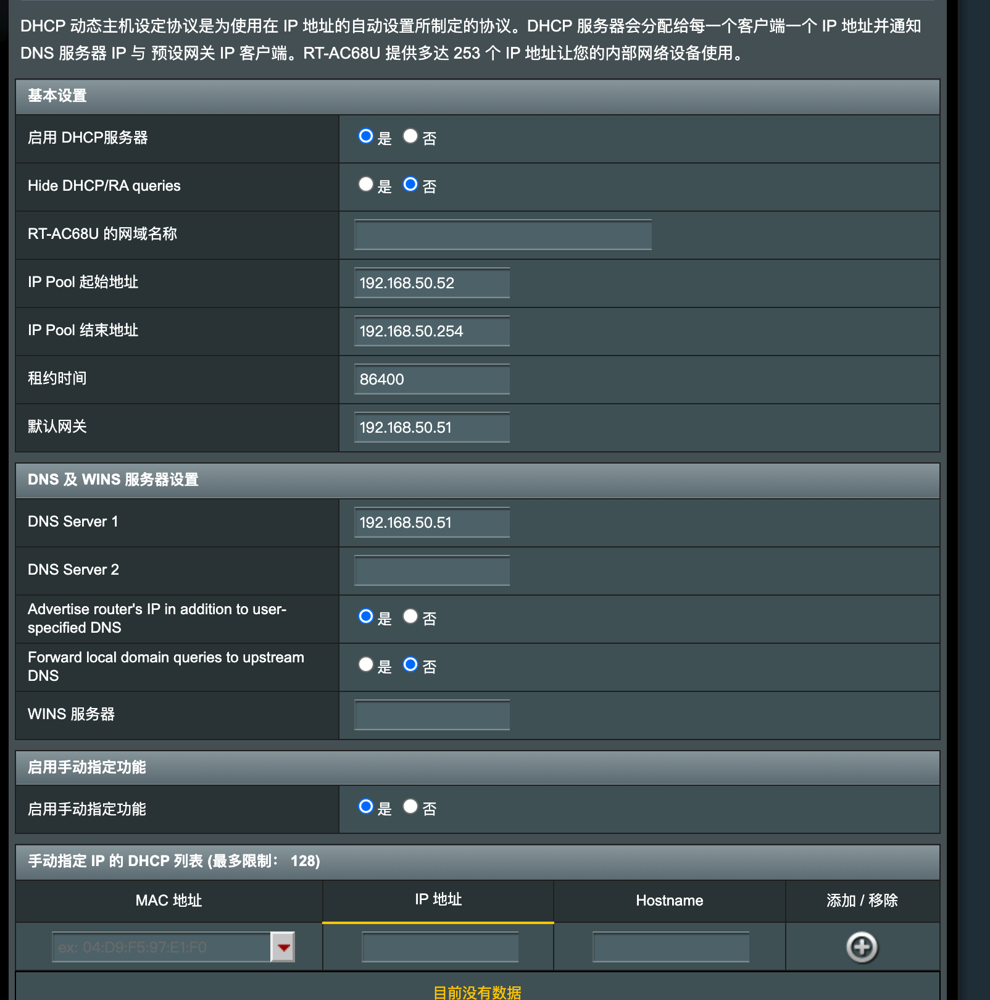
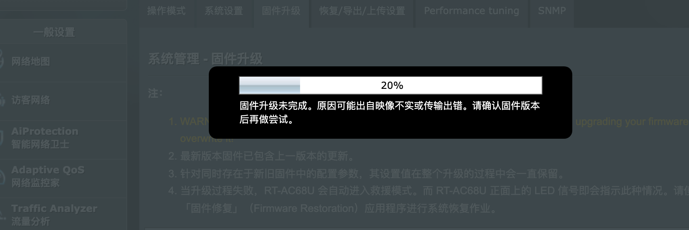
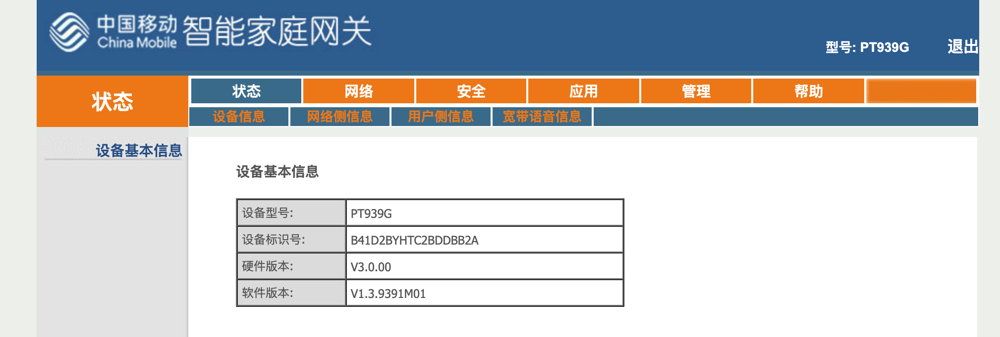
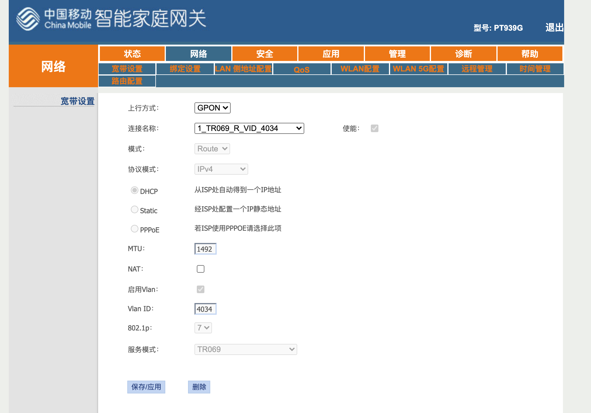
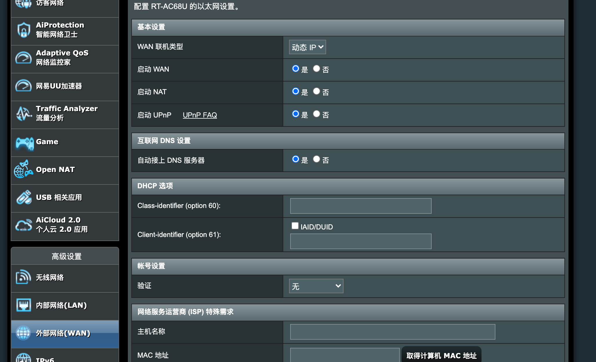
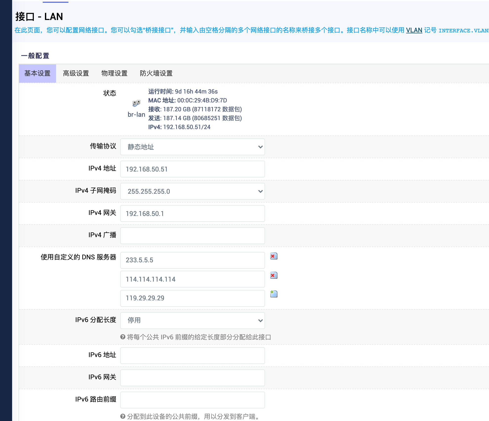

# ax68u升级需要组成mesh

# 记录原始设置

# 升级提示报错

# ac68U 升级固件就完成

# 光猫拨号切换成软路由拨号

光猫改成桥接
1. 怎么找到切换菜单
2. pppoe的账号和密码（需要跟换光猫才可以，好坑）

不用，找到超级管理账号密码就行
账号：CMCCAdmin
密码：aDm8H%MdA

user
Dq726#pM

怎么获取账号密码呢？

账号在光猫的正面：
账号：hzbja57120624
密码：818713/ 重置成123456

前提条件准备好了，下一步开始设置

光猫没有切换成功

http://router.asus.com

# 1 光猫设置桥接模式

# 原始光猫网络设置

