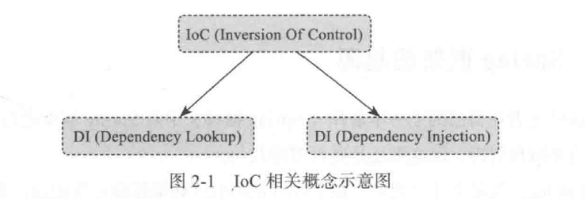

# springboot揭秘-快速构建微服务体系

# 微服务的概念
实际上SOA演化到后期就变成微服务，构架原则：

* 服务封装
* 服务松耦合(Loosely coupled) - 服务之间的关系最小化，只是互相知道。
* 服务契约 - 服务按照服务描述文档所定义的服务契约行事。
* 服务抽象 - 除了服务契约中所描述的内容，服务将对外部隐藏逻辑。
* 服务的重用性 - 将逻辑分布在不同的服务中，以提高服务的重用性。
* 服务的可组合性 - 一组服务可以协调工作并组合起来形成一个组合服务。
* 服务自治 – 服务对所封装的逻辑具有控制权
* 服务无状态 – 服务将一个活动所需保存的信息最小化。
* 服务的可被发现性 – 服务需要对外部提供描述信息，这样可以通过现有的发现机制发现并访问这些服务。
除此以外，在定义一个SOA实现时，还需要考虑以下因素：
* 生命周期管理
* 有效使用系统资源
* 服务成熟度和性能

# 回顾探索spring本质
## IOC
有两种方式，一种是依赖注入（被动），一种是依赖查找（主动）

## spring工作的两个步骤
1，收集bean
2，组装bean
3，准备工作

其中形式就是xml 配置，或者注解

## 高曝光率的Annotation
## @ComponentScan
配合一些元信息Java Annotation 例如@Component 和 @Repository，可以将标注这些元信息的bean批量采集到spring的IoC容器中。

**注意一点**
使用@ComponentScan可以通过basePackages等属性来细粒度地定制自动的扫描的范围，如果不指定Spring框架会实现从声明@ComponentScan所在类的package进行扫描
这样我就知道了，为什么springboot的启动类要放在顶层

# springboot的工作本质

## SpringBootApplication 背后的秘密
实际上它是三体结构
### @Configuration
### @EnableAutoConfiguration
它也是一个复合注解
@Import（EnableAutoConfigurationImportSelector.class）
通过上面这个，将所有符合条件的@Configuration 配置都加载到当前Springboot创建并使用的Ioc容器
### @ComponentScan
三个注解的结合体

## 探索SpringApplication 执行流程

# 了解纷杂的Spring-Boot-Start
第四章

