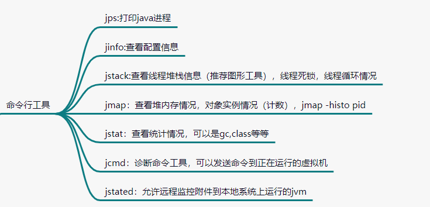
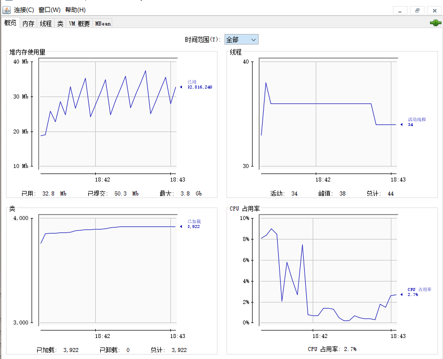
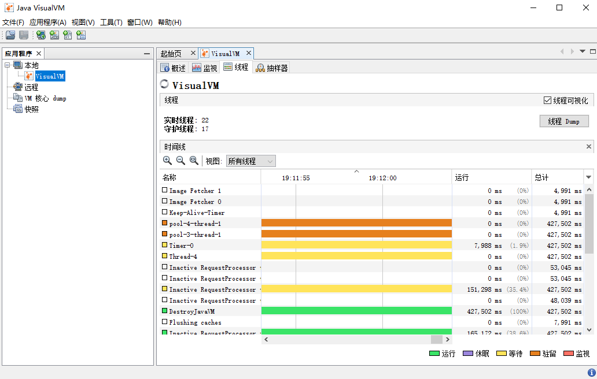
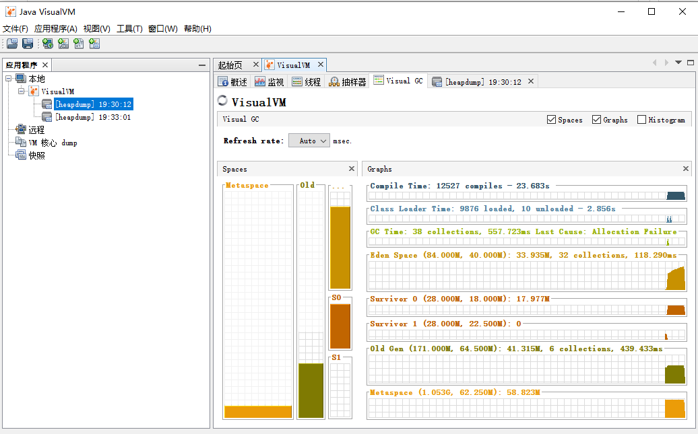

# 虚拟机故障定位与参数优化

# 命令工具

# 图形工具

## jconsole
统计信息比较全
- 但是为啥ssh连接的时候jsonsole没有反应？[jsonsole分为本地连接的远程连接，有时候线上环境比较复杂，没有远程连接jconsole的条件，还是需要配合命令配查]
- 

## jmc
需要单独安装，相对于jconsole来说，它单独运行，不消耗监视jvm性能。同时又飞行记录器的功能（特点，录制jvm操作记录）

## VsiualVM
插件化，更具需要的功能进行安装

# 远程连接

远程服务配置 + 客户端配置

