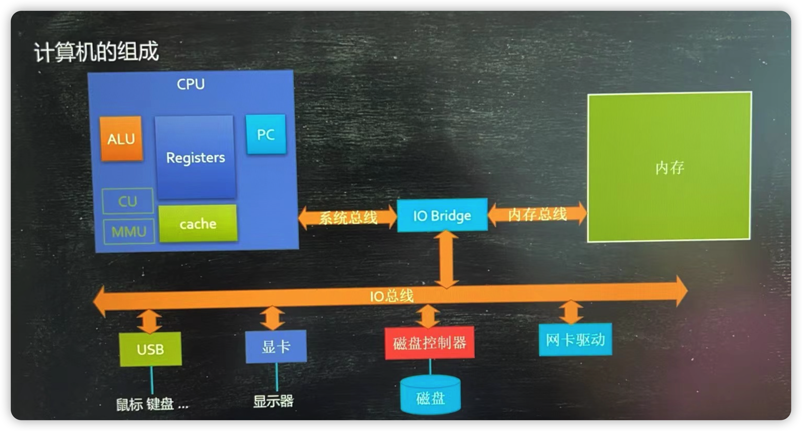
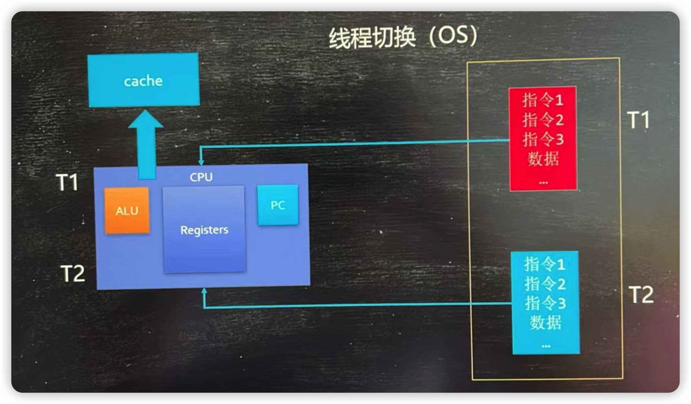
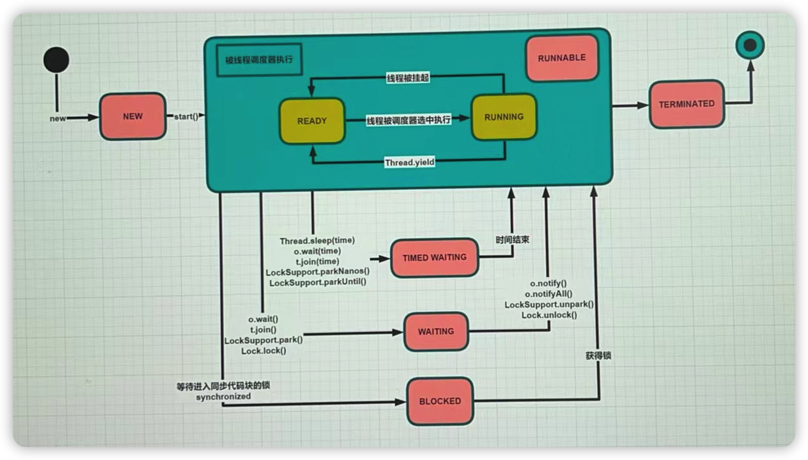

1. 时间不充裕-背
2. 时间充裕-慢慢做实验+背

# 线程历史

* 单进程人工切换 - 纸带机
* 多进程批处理 - 多个任务批量执行
* 多进程并行处理 - 把程序卸载不同的内存位置来回切换
* 多线程
  - 一个程序内部不同任务来回切换
  - selector - epoll
* 协程
  * 绿色线程，用户管理的（而不是os管理的）线程

# 基础概念

* 什么是进程？-计算机进行资源分配的基本单元

  先了解计算机组成

  

* 什么是线程？

  通俗角度 - 程序不同的执行路径。

  专业角度 - 程序调度执行的基本单位，一个进程可以包含多个线程

* 什么是线程切换？

  

# 问题思考

## 单核cpu设定多线程是否有意义？
  有意义，任务中 有io 和 cpu，io速度慢，cpu计算速度快
## 工作线程是不是设置越大越好？
  不是，线程切换需要消耗资源

## 工作线程（线程池中的线程数量）设多少合适？

公式  ：N = cpu核数 * cpu利用率 *（ 1 + 等待时间/计算时间 ）

profiler 计算 等待时间/计算时间 值   

## 创建线程的方式有哪些？

带有返回值的有两种  Future 和 线程池，FutureTask  和 实现了Callable的接口

继承thread 重写run

实现 runable 接口

lambada表达式

# 线程状态

* new
* runable（ready runing）
* terminated
* timed wating
* wating
* blocked

# 线程打断interrupt

​    