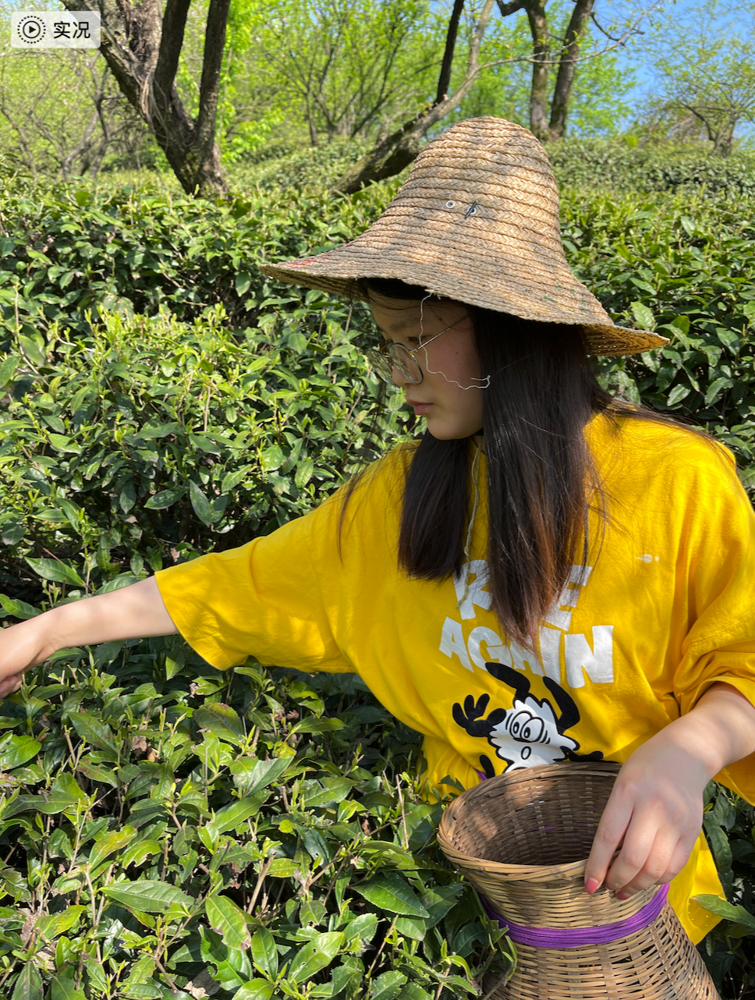

# 清明闲思

今天是清明节2021-4-4，丹丹和同学一起去长沙玩了。从她发的消息和视频来看感觉还玩的不错。

昨天放假我一个人宅了一天，等把这个日记写完我就回余杭去了，老妈一个人在家。平时也很少有时间陪家人。

这两天过的有点混沌，一个人反思的时间也是越来越少。总感觉有点话想说，可是说不明白。

可能也是缺少表达的原因，以后我也要多表达，毕竟人是群居动物。

内心也有点忧虑，担心工作上的事，也是认真想下也没啥可担心的，平时多思考做总结多学习多积累（填充自己的技能树），白白担心也没用！

前几天的去采茶的图片放下吧，不分享出来，平时也很少去看。
茶山的景色现在回想起来真的挺好看的

还有不说话的时候她，挺好的，哈哈

